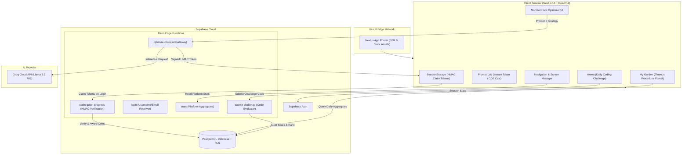

# Nemora 🌲

Nemora is an eco-conscious AI platform that measures, visualizes, and slashes the carbon footprint of AI prompt engineering and software development. By transforming prompt compression and code efficiency into a visual, gamified experience, Nemora empowers developers to build high-performance AI systems while mitigating the environmental impact of large language models.

---

## ✨ Features

- **Prompt Lab:** Instantaneous, client-side token counting and carbon emission estimation (<10ms latency, zero external network calls) paired with an interactive 3D Earth ecosystem visualization.
- **Monster Hunt:** Multi-strategy AI prompt optimizer powered by Groq (`llama-3.3-70b-versatile`). Features three specialized compression modes:
  - `Compress`: Maximizes token density while preserving functional requirements and code snippets verbatim.
  - `Facts-Only`: Strips conversational filler and extracts strict technical specifications.
  - `Bullet Points`: Converts wordy prompts into concise, structured bulleted instructions.
- **Guest-to-User Reward Bridge:** Guests can freely test prompt optimization and accumulate Eco-Coins. Cryptographically signed HMAC-SHA256 claim tokens stored in `sessionStorage` allow users to securely claim their earned rewards upon sign-up, preventing client-side forgery.
- **My Garden:** Procedural 3D digital sanctuary where every day of carbon savings plants a permanent tree. Tree heights scale dynamically based on total CO2 captured, and deterministic placement ensures trees never jump across sessions. Includes an interactive 7-day carbon activity chart.
- **Arena:** Daily code optimization challenges and a real-time global leaderboard ranking developers by carbon efficiency.
- **Global Carbon Monitor:** Real-time platform statistics in the navigation bar displaying total carbon saved and mature tree equivalents.

---

## 🛠️ Tech Stack

- **Frontend Framework:** Next.js 16 (App Router), React 19, TypeScript
- **Styling:** Tailwind CSS 4, Lucide React Icons, Sonner Toasts
- **3D Graphics & Animation:** Three.js, React Three Fiber (`@react-three/fiber`), React Three Drei (`@react-three/drei`), Framer Motion
- **Data Visualization:** Recharts
- **State Management:** Zustand
- **Database & Auth:** Supabase (PostgreSQL, Row Level Security, Realtime Subscriptions, Supabase Auth)
- **Serverless Edge Compute:** Deno-powered Supabase Edge Functions
- **AI Engine:** Groq Cloud API (OpenAI-compatible Chat Completions)
- **Deployment & Hosting:** Vercel (Frontend CI/CD) and Supabase Cloud (Backend & Edge Runtime)

---

## 🏗️ Architecture



---

## 📁 Project Structure

```text
Nemora/
├── app/
│   ├── globals.css              # Global styles and Tailwind 4 configuration
│   ├── layout.tsx               # Root layout and theme providers
│   └── page.tsx                 # Core application shell and screen router
├── components/
│   ├── auth/                    # Authentication modal and user badge chips
│   ├── screens/
│   │   ├── arena.tsx            # Coding challenge arena and leaderboard
│   │   ├── monster-hunt.tsx     # AI prompt optimization interface
│   │   ├── my-garden.tsx        # 3D digital forest and 7-day savings chart
│   │   └── prompt-lab.tsx       # Real-time client-side prompt analysis
│   ├── three/                   # React Three Fiber 3D meshes and scenes
│   │   ├── crystal-orb.tsx      # Optimized prompt 3D visualizer
│   │   ├── earth-tree.tsx       # Prompt Lab revolving globe
│   │   ├── garden-scene.tsx     # Procedural forest renderer with deterministic placement
│   │   └── pollution-shard.tsx  # Unoptimized prompt 3D visualizer
│   └── navigation.tsx           # Global navigation with live platform stats
├── lib/
│   ├── api.ts                   # Supabase client invocations and guest claim storage
│   ├── auth-store.ts            # Zustand store for Supabase authentication
│   ├── co2.ts                   # Standardized token and carbon calculation formulas
│   ├── store.ts                 # Shared UI state and screen management
│   └── supabase.ts              # Browser Supabase client initialization
├── supabase/
│   ├── functions/
│   │   ├── _shared/             # Shared Edge Function utilities (CORS, HMAC, types)
│   │   ├── claim-guest-progress/# Verifies and credits guest optimization claims
│   │   ├── login/               # Resolves username or email for authentication
│   │   ├── optimize/            # Groq AI prompt compression with HMAC signing
│   │   ├── stats/               # Cached global carbon reduction statistics
│   │   └── submit-challenge/    # Validates daily coding challenge submissions
│   └── migrations/
│       ├── 0001_init.sql        # Tables, views, and Row Level Security policies
│       ├── 0002_auth.sql        # Profile triggers on user creation
│       ├── 0003_seed_challenges.sql # Daily challenge initial seed records
│       └── 0004_guest_claims.sql    # Guest claim tracking and deduplication table
└── .github/workflows/
    └── deploy-functions.yml     # Automated CI/CD for Supabase Edge Functions
```

---

## ⚙️ Local Development Setup

### Prerequisites

- [Node.js](https://nodejs.org/) (version 18 or higher)
- [npm](https://www.npmjs.com/) or [pnpm](https://pnpm.io/)
- [Supabase CLI](https://supabase.com/docs/guides/cli) (optional, for local Edge Function testing)

### Installation

1. **Clone the repository:**
   ```bash
   git clone https://github.com/Mujtaba-007/Nemora.github.io.git
   cd Nemora
   ```

2. **Install dependencies:**
   ```bash
   npm install
   ```

3. **Configure environment variables:**
   Copy the example environment configuration:
   ```bash
   cp .env.local.example .env.local
   ```
   Fill in your Supabase project credentials in `.env.local`:
   ```bash
   NEXT_PUBLIC_SUPABASE_URL=https://your-project-id.supabase.co
   NEXT_PUBLIC_SUPABASE_ANON_KEY=your-anon-key
   ```

4. **Run the development server:**
   ```bash
   npm run dev
   ```
   Open [http://localhost:3000](http://localhost:3000) in your browser.

---

## 🔐 Environment Variables

### Frontend (`.env.local` / Vercel Dashboard)

| Variable | Description |
|---|---|
| `NEXT_PUBLIC_SUPABASE_URL` | Public API URL of your Supabase project. |
| `NEXT_PUBLIC_SUPABASE_ANON_KEY` | Public anonymous key for client-side Supabase calls. |

### Supabase Edge Functions (Configured via `supabase secrets set`)

| Secret Name | Description |
|---|---|
| `GROQ_API_KEY` | API key from Groq Console for LLM inference. |
| `GROQ_MODEL` | *(Optional)* Model identifier (defaults to `llama-3.3-70b-versatile`). |
| `GUEST_CLAIM_SECRET` | Secret key used to sign and verify HMAC-SHA256 guest claim tokens. |
| `SUPABASE_URL` | Automatically populated by Supabase Edge Runtime. |
| `SUPABASE_ANON_KEY` | Automatically populated by Supabase Edge Runtime. |
| `SUPABASE_SERVICE_ROLE_KEY` | Automatically populated by Supabase Edge Runtime. |

---

## 🗄️ Database Migrations & Edge Functions

### Deploying Database Migrations

Apply migration files in sequential order using the Supabase Dashboard SQL Editor or the Supabase CLI:

```bash
# Link project (if using CLI)
supabase link --project-ref your-project-ref

# Apply migrations
supabase db push
```

Migration sequence:
1. `0001_init.sql` — Profiles, prompt events, challenges, views (`leaderboard`, `garden_daily`, `global_stats`), and RLS rules.
2. `0002_auth.sql` — Automated profile provisioning trigger on user signup.
3. `0003_seed_challenges.sql` — Starter daily challenges.
4. `0004_guest_claims.sql` — Idempotent guest claim verification table.

### Deploying Edge Functions

Deploy functions individually via the Supabase CLI:

```bash
supabase functions deploy optimize --no-verify-jwt
supabase functions deploy submit-challenge --no-verify-jwt
supabase functions deploy stats --no-verify-jwt
supabase functions deploy login --no-verify-jwt
supabase functions deploy claim-guest-progress --no-verify-jwt
```

Alternatively, push to the `main` branch to trigger the automated GitHub Actions deployment workflow defined in `.github/workflows/deploy-functions.yml`.

---

## 🚀 Vercel Deployment

Nemora is optimized for deployment on Vercel:

1. Import your GitHub repository into the [Vercel Dashboard](https://vercel.com).
2. Select the **Next.js** framework preset.
3. Set the Environment Variables:
   - `NEXT_PUBLIC_SUPABASE_URL`
   - `NEXT_PUBLIC_SUPABASE_ANON_KEY`
4. Deploy. Vercel automatically runs `npm run build` and distributes the application across global edge nodes.

---

## 🤝 Contributing

Contributions to improve prompt compression strategies, 3D shaders, or environmental accuracy are welcome!

1. Fork the repository.
2. Create your feature branch (`git checkout -b feature/eco-enhancement`).
3. Verify TypeScript type safety (`npm run build` or `npx tsc --noEmit`).
4. Commit your changes (`git commit -m "Add new eco-feature"`).
5. Push to the branch (`git push origin feature/eco-enhancement`).
6. Open a Pull Request.

---

## 📄 License

Distributed under the MIT License.
